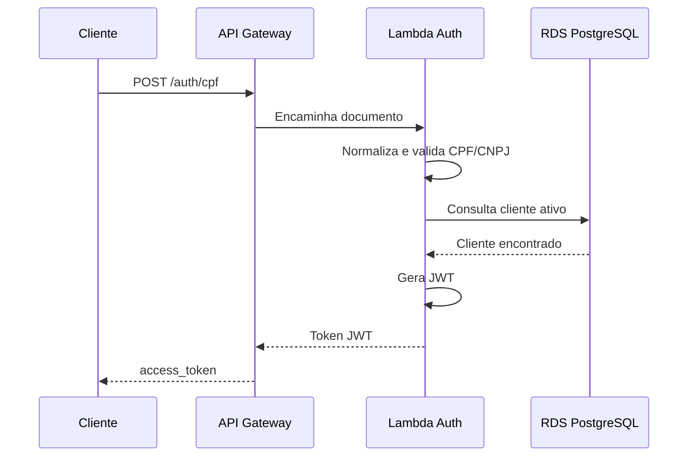

# Sequencia: Autenticacao Por CPF/CNPJ

```mermaid
sequenceDiagram
    participant Client as Cliente
    participant Gateway as API Gateway
    participant Lambda as Lambda Auth
    participant DB as RDS PostgreSQL

    Client->>Gateway: POST /auth/cpf
    Gateway->>Lambda: Encaminha documento
    Lambda->>Lambda: Normaliza e valida CPF/CNPJ
    Lambda->>DB: Consulta cliente ativo
    DB-->>Lambda: Cliente encontrado
    Lambda->>Lambda: Gera JWT
    Lambda-->>Gateway: Token JWT
    Gateway-->>Client: access_token
```

